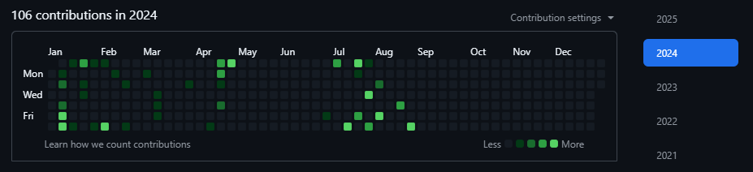
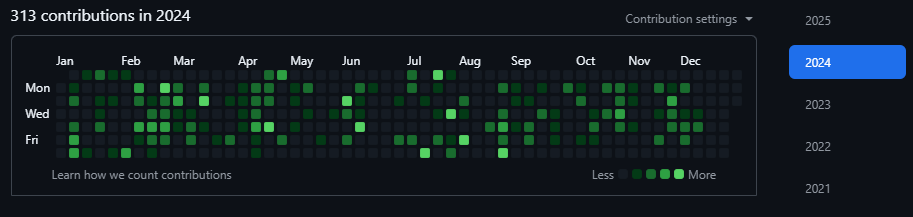

# 

# 🚀 GitVeil

**Keep your GitHub active, without exposing your code.**

---

## Overview

**GitVeil** is a local CLI tool that syncs your professional development activity to a personal GitHub repository, in a **discreet**, **automated**, and **confidential** way. It replays your commits in an anonymized form, never copying any source code.

---

## Why choose GitVeil ?

- 👀 **Visibility**: Keep your GitHub contribution graph active, even for private work.
- 🔒 **Privacy**: No code is copied, everything stays local, 100% private.
- 🧘 **Simplicity**: Quick installation, guided configuration, minimalist usage.

---

## Installation

```bash
npm i git-veil -g
```

## Complete Setup

```bash
# 1. Initialize GitVeil configuration
# Configure your email, name, and target repository path
gitveil config --init

# 2. Record your recent Git activity
# Scans your Git history using your configured email to identify your commits
# Creates record entries for each commit found in the history
gitveil record

# 3. Check the synchronization status
# View pending records and sync status
gitveil status

# 4. Push anonymized commits to your GitHub repository
# Pushes all recorded commits to your mirror repository (created in step 1)
# Existing commits are ignored, no source code is published - only incremental 
# README updates to preserve commit history while ensuring anonymity and security
gitveil push
```

---

## Main commands

- `gitveil config --init`: Initialize configuration
- `gitveil record`: Extract and save filtered Git activity
- `gitveil status`: Show sync status and pending records
- `gitveil push`: Push anonymized commits to GitHub
- `gitveil config`: Edit configuration (email, path, etc)

---

You are now set up! Your GitHub activity graph will reflect your professional work—without exposing any code.

## Privacy


 - No code is ever copied
 - No network access to professional repositories
 - Everything happens locally, on your machine

## 🔍 Transparency & Security


**GitVeil is 100% transparent and auditable WITHOUT repository access:**

- � **Complete source code** included in npm package
- 🔍 **No repository required**: Audit using only `npm install git-veil`
- 📖 **Full TypeScript sources** available in `node_modules/git-veil/src/`
- 🛡️ **No telemetry**: No data collection or tracking
- 🔒 **Local only**: All processing happens on your machine
- ⚡ **Minimal dependencies**: Only 3 trusted runtime dependencies

**Audit GitVeil in 3 steps:**
```bash
npm install git-veil
cd node_modules/git-veil
npm run integrity:verify  # Check code integrity
```

**Security by design:**
- No code extraction or copying
- No hidden network calls
- Clear, readable TypeScript code
- MIT licensed for maximum transparency

📋 **[Complete Audit Guide](./AUDIT.md)** - Full instructions for security review
 

---

## Default flow

1. Detect Git context
2. Extract commits linked to your email
3. Generate discrete commits
4. Push to GitHub

---

## Screenshot

Before :



After :



---

## Support

If **GitVeil** has been helpful to you, consider supporting its continued development:

[](https://coff.ee/nicolastardieu)


Your support helps keep this project alive and motivates further improvements.  
Even a small gesture makes a big difference — thank you! 🙏


---

## License

MIT